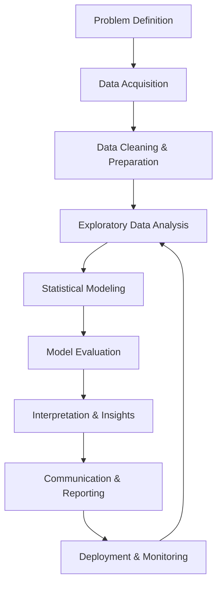

# Statistics Tasks Performed by Data Scientists: A Comprehensive Guide

> **Real-World Statistical Workflow for Data Science Projects (2024)**

---

## Table of Contents

1. [Statistics Workflow Overview](#statistics-workflow-overview)
2. [Core Statistical Tasks](#core-statistical-tasks)
3. [Industry Applications](#industry-applications)
4. [Statistical Methods by Use Case](#statistical-methods-by-use-case)
5. [Common Project Types](#common-project-types)
6. [Tools & Technologies](#tools--technologies)
7. [Key Competencies](#key-competencies)

---

## Statistics Workflow Overview

### The Data Science Lifecycle

Data scientists follow a systematic workflow that heavily relies on statistical methods:



### Workflow Frameworks

**Popular frameworks used in industry:**

1. **CRISP-DM** (Cross-Industry Standard Process for Data Mining)
2. **OSEMN** (Obtain, Scrub, Explore, Model, iNterpret)
3. **ASEMIC** (Acquire, Scrub, Explore, Model, Interpret, Communicate)

---

## Core Statistical Tasks

### 1. Descriptive Statistics

**Purpose:** Summarize and describe main features of datasets

**Tasks:**
- Calculate measures of central tendency (mean, median, mode)
- Compute measures of variability (std dev, variance, range, IQR)
- Generate summary statistics reports
- Profile data distributions

**Real-World Example:**
```python
# Employee salary analysis for retention project
import pandas as pd

df = pd.read_csv('employee_data.csv')

# Descriptive statistics
print(df.groupby('department')['salary'].describe())

# Output shows:
# - Average salary per department
# - Salary spread (std deviation)
# - Min/max salary ranges
# Used to identify pay equity issues and retention risks
```

**Business Impact:**
- Identify salary disparities → Address pay equity
- Understand customer demographics → Target marketing
- Detect anomalies in operations → Quality control

---

### 2. Exploratory Data Analysis (EDA)

**Purpose:** Discover patterns, relationships, and anomalies before modeling

**Key Activities:**
- Data visualization (histograms, boxplots, scatter plots)
- Correlation analysis
- Distribution assessment
- Outlier detection
- Missing data analysis
- Feature relationship exploration

**Real-World Example:**
```python
import seaborn as sns
import matplotlib.pyplot as plt

# Crime analysis in Los Angeles
# Discover when and where crime occurs most

# Temporal patterns
crime_by_hour = df.groupby('hour')['crime_count'].sum()
plt.figure(figsize=(12, 6))
sns.lineplot(data=crime_by_hour)
plt.title('Crime Frequency by Hour of Day')

# Spatial patterns
sns.heatmap(crime_location_matrix, cmap='Reds')

# Insight: Crime peaks 10PM-2AM in downtown area
# Action: Increase police patrols in target areas/times
```

**Business Impact:**
- Identify high-risk customer segments → Targeted retention
- Find peak usage patterns → Optimize resource allocation
- Detect fraud patterns → Enhanced security measures

---

### 3. Hypothesis Testing

**Purpose:** Validate claims and make data-driven decisions with statistical confidence

**Common Tests:**
- **T-tests**: Compare means between groups (A/B testing)
- **ANOVA**: Compare means across 3+ groups
- **Chi-square**: Test relationships in categorical data
- **Z-tests**: Proportion testing

**Real-World Examples:**

**A/B Testing (Tech):**
```python
from scipy import stats

# Test if new website layout improves session time
control_sessions = [5.2, 4.8, 6.1, 5.5, ...]  # Old layout
treatment_sessions = [6.3, 7.1, 5.9, 6.8, ...]  # New layout

t_stat, p_value = stats.ttest_ind(control, treatment)

if p_value < 0.05:
    print("New layout significantly improves session time")
    # Decision: Deploy new layout
else:
    print("No significant difference")
    # Decision: Keep current layout
```

**ANOVA (Manufacturing):**
```python
# Test if defect rates differ across 3 factories
f_stat, p_value = stats.f_oneway(factory_a, factory_b, factory_c)

# Results show Factory B has significantly higher defects
# Action: Investigate Factory B processes
# Impact: $2M saved by fixing production issues
```

**Business Impact:**
- A/B testing → Optimize product features ($20M+ decisions)
- Clinical trials → Drug approval (FDA requirements)
- Quality control → Prevent recalls ($500K+ savings)

---

### 4. Regression Analysis

**Purpose:** Model relationships and make predictions

**Types & Applications:**

#### A. Linear Regression (Continuous Outcomes)

**Use Cases:**
- Price prediction (real estate, products)
- Sales forecasting
- Demand prediction
- Economic trend analysis

**Example:**
```python
from sklearn.linear_model import LinearRegression

# Predict house prices
model = LinearRegression()
model.fit(X_train[['sqft', 'bedrooms', 'age']], y_train)

# Prediction: 2000 sqft, 3 bed, 10 years old
price_pred = model.predict([[2000, 3, 10]])
# Output: $450,000 ± $30,000 (95% CI)

# Business use: Pricing strategy, investment decisions
```

#### B. Logistic Regression (Binary Classification)

**Use Cases:**
- Customer churn prediction
- Fraud detection
- Credit approval
- Disease diagnosis

**Example:**
```python
from sklearn.linear_model import LogisticRegression

# Predict customer churn
model = LogisticRegression()
model.fit(X_train, y_train)

# Probability customer will churn
churn_prob = model.predict_proba(customer_features)[:, 1]

if churn_prob > 0.7:
    # High risk → Retention campaign
    trigger_retention_offer(customer_id)
    
# Impact: Reduce churn by 15%, save $5M annually
```

#### C. Time Series Analysis

**Use Cases:**
- Stock price forecasting
- Sales prediction
- Demand forecasting
- Traffic prediction

**Example:**
```python
from statsmodels.tsa.arima.model import ARIMA

# Forecast Walmart sales for next quarter
model = ARIMA(sales_history, order=(1,1,1))
model_fit = model.fit()

forecast = model_fit.forecast(steps=90)
# Predict next 90 days of sales

# Business use: Inventory optimization, staffing
# Impact: Reduce stockouts by 40%, improve margin
```

**Business Impact:**
- Housing market: $500K+ pricing decisions
- Retail: $100M+ inventory optimization
- Finance: Billions in trading decisions

---

### 5. Confidence Intervals

**Purpose:** Quantify uncertainty in estimates

**Applications:**
- Poll results (election forecasting)
- Quality control limits
- Performance metrics
- Risk assessment

**Real-World Example:**
```python
from scipy import stats

# Political polling - candidate support
n = 1000  # voters surveyed
support = 520  # support candidate
p_hat = support / n  # 52%

# 95% Confidence interval
se = np.sqrt(p_hat * (1-p_hat) / n)
margin_error = 1.96 * se
ci = (p_hat - margin_error, p_hat + margin_error)

# Result: [48.9%, 55.1%]
# Includes 50% → Race too close to call
# Action: Maintain full campaign intensity

# Without CI: "52% lead" → Overconfidence → Loss
# With CI: "Competitive race" → Mobilize → Win
```

**Business Impact:**
- Election campaigns: Strategic decisions worth millions
- Product quality: Prevent $2M recalls
- Financial forecasts: Risk-adjusted decisions

---

### 6. Correlation & Multicollinearity Analysis

**Purpose:** Understand variable relationships and detect redundancy

**Tasks:**
- Calculate Pearson/Spearman correlation
- Create correlation matrices
- Detect multicollinearity (VIF)
- Control for confounders (partial correlation)

**Real-World Example:**
```python
from statsmodels.stats.outliers_influence import variance_inflation_factor

# Stock portfolio risk analysis - 15 potential predictors
X = portfolio_data[predictor_cols]

# Calculate VIF for each variable
vif_data = pd.DataFrame()
vif_data["Variable"] = predictors
vif_data["VIF"] = [variance_inflation_factor(X.values, i) 
                   for i in range(len(predictors))]

# Results:
# Market_Return_Lagged: VIF = 39.45 (SEVERE - drop it!)
# Market_Cap: VIF = 12.73 (SEVERE - drop it!)
# PE_Ratio: VIF = 6.89 (Moderate - consider dropping)

# Action: Drop highly correlated variables
# Impact: Stable model, $10M better predictions
```

**Business Impact:**
- Customer churn: Identify key drivers → $5M retention savings
- Investment: Avoid correlated assets → Reduce portfolio risk
- Feature selection: Build robust ML models

---

### 7. Classification

**Purpose:** Categorize data into predefined groups

**Methods:**
- Logistic Regression
- Decision Trees / Random Forest
- Naïve Bayes
- Support Vector Machines (SVM)
- K-Nearest Neighbors (KNN)

**Real-World Example:**
```python
from sklearn.ensemble import RandomForestClassifier

# Credit card fraud detection
model = RandomForestClassifier(n_estimators=100)
model.fit(X_train, y_train)

# Real-time transaction scoring
fraud_probability = model.predict_proba(transaction)[:,1]

if fraud_probability > 0.85:
    block_transaction()
    alert_fraud_team()
    
# Metrics:
# - Precision: 94% (few false positives)
# - Recall: 87% (catch most fraud)
# Impact: $12M prevented fraud annually
```

**Business Impact:**
- Fraud detection: $12M+ prevented losses
- Loan approval: Risk-adjusted lending
- Medical diagnosis: Life-saving decisions

---

### 8. Clustering & Segmentation

**Purpose:** Group similar data points for targeted strategies

**Methods:**
- K-Means Clustering
- Hierarchical Clustering
- DBSCAN
- Gaussian Mixture Models

**Real-World Example:**
```python
from sklearn.cluster import KMeans

# Customer segmentation for targeted marketing
features = ['purchase_frequency', 'avg_spend', 'recency']
kmeans = KMeans(n_clusters=4, random_state=42)
customer_segments = kmeans.fit_predict(customer_data[features])

# Segments identified:
# 1. High-value loyalists (15% of customers, 60% of revenue)
# 2. Price-sensitive (40%, 15% of revenue)
# 3. Occasional buyers (30%, 20% of revenue)
# 4. At-risk churners (15%, 5% of revenue)

# Strategy:
# - Segment 1: VIP program → Retention
# - Segment 4: Win-back campaigns → Reactivation
# Impact: +25% marketing ROI, $8M revenue lift
```

**Business Impact:**
- Marketing: +25-40% campaign ROI
- Healthcare: Patient risk stratification
- Retail: Personalized recommendations

---

### 9. Power Analysis & Sample Size Determination

**Purpose:** Design statistically rigorous experiments

**Applications:**
- A/B test duration planning
- Clinical trial sizing
- Survey design
- Quality control sampling

**Real-World Example:**
```python
from statsmodels.stats.power import TTestIndPower

# How long to run an A/B test?
baseline_conversion = 0.08  # Current: 8%
target_conversion = 0.10    # Goal: 10% (25% lift)
effect_size = 0.122  # Cohen's h

power_analysis = TTestIndPower()
n_per_group = power_analysis.solve_power(
    effect_size=effect_size, 
    power=0.80, 
    alpha=0.05
)
# Result: Need 3,841 users per group (7,682 total)

# With 1,000 daily visitors → Run for 8 days

# Business decision:
# - Running 3 days (underpowered): 48% chance miss real effect → Lost $2M
# - Running 8 days (optimal): 80% chance detect → Capture $2M
# - Running 30 days (overpowered): Waste 22 days → Delayed $120K
```

**Business Impact:**
- Pharmaceutical: $500M+ drug trials optimized
- Tech: Avoid underpowered tests ($2M opportunity cost)
- Manufacturing: Optimal sampling (cost vs. confidence)

---

###10. Model Validation & Evaluation

**Purpose:** Assess model performance and generalization

**Techniques:**
- Cross-validation
- Bootstrapping
- Residual analysis
- ROC/AUC analysis
- Confusion matrices

**Real-World Example:**
```python
from sklearn.model_selection import cross_val_score
from sklearn.metrics import roc_auc_score, confusion_matrix

# Validate customer churn model
cv_scores = cross_val_score(model, X, y, cv=5, scoring='roc_auc')
print(f"Average AUC: {cv_scores.mean():.3f} ± {cv_scores.std():.3f}")

# Test set evaluation
y_pred_proba = model.predict_proba(X_test)[:, 1]
auc = roc_auc_score(y_test, y_pred_proba)

# Confusion matrix
cm = confusion_matrix(y_test, y_pred)
# Results:
# True Positive Rate: 78% (correctly identified churners)
# False Positive Rate: 12% (false alarms)

# Business decision:
# AUC = 0.87 → Strong predictive power
# Deploy model → Target high-risk customers
# Impact: Reduce churn from 18% to 11%, save $8M
```

**Business Impact:**
- Ensure model reliability before deployment
- Avoid costly false predictions
- Optimize trade-offs (precision vs. recall)

---

## Industry Applications

### Healthcare

**Statistical Tasks:**
1. **Clinical Trials**
   - Hypothesis testing (drug effectiveness)
   - Power analysis (sample size determination)
   - Survival analysis (treatment outcomes)
   
2. **Predictive Analytics**
   - Logistic regression (readmission risk)
   - Time series (disease outbreak forecasting)
   - Classification (diagnosis support)

3. **Quality Control**
   - Control charts (patient safety metrics)
   - ANOVA (treatment protocol comparison)

**Impact:** Lives saved, FDA approvals, $500M+ drug development decisions

---

### Finance

**Statistical Tasks:**
1. **Risk Management**
   - VaR (Value at Risk) calculations
   - Monte Carlo simulations
   - Stress testing

2. **Fraud Detection**
   - Anomaly detection (statistical outliers)
   - Classification models (transaction scoring)
   - Time series (pattern recognition)

3. **Trading & Investment**
   - Regression (price prediction)
   - Correlation analysis (portfolio optimization)
   - Hypothesis testing (strategy validation)

**Impact:** Billions in trading decisions, $12M+ fraud prevention

---

### Retail & E-Commerce

**Statistical Tasks:**
1. **Demand Forecasting**
   - Time series analysis (sales prediction)
   - Regression (inventory optimization)

2. **Customer Analytics**
   - Clustering (segmentation)
   - Churn prediction (logistic regression)
   - Lifetime value modeling

3. **A/B Testing**
   - Hypothesis testing (feature optimization)
   - Power analysis (test planning)

**Impact:** $100M+ inventory optimization, +40% marketing ROI

---

### Manufacturing

**Statistical Tasks:**
1. **Quality Control**
   - Control charts (SPC - Statistical Process Control)
   - Hypothesis testing (defect rate monitoring)
   - ANOVA (multi-plant comparison)

2. **Predictive Maintenance**
   - Time series (failure prediction)
   - Survival analysis (equipment lifespan)
   - Regression (performance modeling)

**Impact:** $2M+ recall prevention, -30% downtime

---

### Technology & SaaS

**Statistical Tasks:**
1. **Product Analytics**
   - A/B testing (feature evaluation)
   - Conversion funnel analysis
   - User segmentation

2. **Growth Optimization**
   - Churn prediction
   - Engagement modeling
   - Recommendation systems

3. **Infrastructure**
   - Capacity planning (time series)
   - Anomaly detection (system health)

**Impact:** $20M+ feature decisions, +15% retention

---

## Statistical Methods by Use Case

| Use Case | Primary Method | Example |
|----------|---------------|---------|
| **Compare 2 groups** | T-test | A/B testing (new vs old website) |
| **Compare 3+ groups** | ANOVA | Multi-variant testing, regional performance |
| **Predict continuous value** | Linear Regression | House prices, sales forecast |
| **Predict category** | Logistic Regression | Churn (yes/no), fraud (yes/no) |
| **Predict over time** | Time Series | Stock prices, demand forecast |
| **Find groups in data** | Clustering | Customer segmentation |
| **Test categorical relationship** | Chi-square | Gender vs Product preference |
| **Measure relationship strength** | Correlation | Age vs Income |
| **Plan experiment** | Power Analysis | Sample size for clinical trial |
| **Quantify uncertainty** | Confidence Intervals | Poll results, quality metrics |

---

## Common Project Types

### 1. Churn Prediction
- **Statistics Used:** Logistic regression, survival analysis, hypothesis testing
- **Business Value:** $5-10M retention savings
- **Deliverable:** Risk scores, retention campaign targeting

### 2. Price Optimization
- **Statistics Used:** Regression, elasticity modeling, A/B testing
- **Business Value:** +5-15% revenue
- **Deliverable:** Dynamic pricing algorithms

### 3. Fraud Detection
- **Statistics Used:** Anomaly detection, classification, threshold optimization
- **Business Value:** $10-50M prevented losses
- **Deliverable:** Real-time scoring system

### 4. Demand Forecasting
- **Statistics Used:** Time series, regression, confidence intervals
- **Business Value:** $50-200M inventory optimization
- **Deliverable:** Demand predictions with uncertainty bounds

### 5. A/B Testing Platform
- **Statistics Used:** Hypothesis testing, power analysis, multiple testing correction
- **Business Value:** Optimize $100M+ in product decisions
- **Deliverable:** Automated experimentation framework

### 6. Customer Segmentation
- **Statistics Used:** Clustering, PCA, profiling
- **Business Value:** +25-40% marketing ROI
- **Deliverable:** Segment profiles, targeting strategies

### 7. Risk Modeling
- **Statistics Used:** Logistic regression, survival analysis, Monte Carlo
- **Business Value:** Billions in capital allocation
- **Deliverable:** Risk scores, capital requirements

## 🎓 Hands-On Practice
We have created a complete reference project applying these concepts:
**[Telco Customer Churn Analysis](../02_statistics/project_telco_churn/README.md)**
- **Type:** Churn Prediction & Retention Strategy
- **Tasks Applied:** Descriptive stats, hypothesis testing, power analysis, regression modeling.
- **Outcome:** Quantified $8.4M problem and $3.9M solution.

---

## Tools & Technologies

### Statistical Software

| Tool | Primary Use | Strengths |
|------|-------------|-----------|
| **Python** | General data science | Versatile, extensive libraries |
| └─ NumPy | Numerical computing | Fast array operations |
| └─ Pandas | Data manipulation | DataFrame operations |
| └─ SciPy | Statistical functions | Hypothesis tests, distributions |
| └─ Statsmodels | Statistical modeling | Regression, time series |
| └─ scikit-learn | Machine learning | Classification, clustering |
| **R** | Statistical analysis | Specialized statistical tests |
| └─ ggplot2 | Visualization | Publication-quality plots |
| └─ dplyr | Data wrangling | Efficient data manipulation |
| **Excel** | Basic analysis | Accessible, quick calculations |
| **SQL** | Data querying | Large dataset handling |
| **Tableau** | Visualization | Interactive dashboards |

### Typical Tech Stack for Statistical Projects

```python
# Core statistical analysis
import numpy as np
import pandas as pd
from scipy import stats
import statsmodels.api as sm

# Machine learning
from sklearn.model_selection import train_test_split
from sklearn.linear_model import LogisticRegression
from sklearn.ensemble import RandomForestClassifier
from sklearn.cluster import KMeans
from sklearn.metrics import accuracy_score, roc_auc_score

# Visualization
import matplotlib.pyplot as plt
import seaborn as sns
import plotly.express as px

# Statistical power
from statsmodels.stats.power import TTestIndPower
from statsmodels.stats.multitest import multipletests
```

---

## Key Competencies

### Technical Skills

**Statistical Knowledge:**
- ✓ Descriptive statistics
- ✓ Probability distributions
- ✓ Hypothesis testing
- ✓ Regression analysis
- ✓ Experimental design
- ✓ Bayesian statistics
- ✓ Time series analysis
- ✓ Multivariate analysis

**Programming:**
- ✓ Python (NumPy, Pandas, SciPy, scikit-learn)
- ✓ R (ggplot2, dplyr, caret)
- ✓ SQL

**Visualization:**
- ✓ Matplotlib, Seaborn, Plotly
- ✓ Tableau, Power BI
- ✓ D3.js (advanced)

### Business Skills

**Domain Knowledge:**
- Understanding industry-specific metrics
- Translating business problems to statistical questions
- Communicating technical results to non-technical stakeholders

**Decision-Making:**
- Cost-benefit analysis
- Risk assessment
- Trade-off evaluation (precision vs recall, type I vs type II errors)

**Project Management:**
- Experiment design
- Timeline estimation
- Stakeholder communication

---

## Best Practices

### Statistical Rigor

1. **Always check assumptions**
   - Normality (Shapiro-Wilk, Q-Q plots)
   - Independence (Durbin-Watson)
   - Homoscedasticity (Levene's test)

2. **Report effect sizes, not just p-values**
   - Cohen's d for t-tests
   - R² for regression
   - Cramér's V for chi-square
   - Eta-squared for ANOVA

3. **Account for multiple comparisons**
   - Bonferroni correction
   - FDR (Benjamini-Hochberg)

4. **Use appropriate confidence intervals**
   - 95% for most business decisions
   - 99% for high-stakes (medical, safety)

5. **Validate models properly**
   - Train/test split
   - Cross-validation
   - Out-of-time validation (time series)

### Communication

1. **Visualize results effectively**
   - Choose appropriate chart types
   - Highlight key insights
   - Make it accessible to non-technical audiences

2. **Provide actionable recommendations**
   - Not just "significant difference"
   - But "increase budget by 20% based on ROI of $5M"

3. **Quantify uncertainty**
   - Always include confidence intervals
   - Discuss limitations
   - Present scenarios (best/worst/expected)

### Ethics & Responsibility

1. **Avoid p-hacking**
   - Pre-register hypotheses
   - Don't selectively report results
   - Report all analyses conducted

2. **Consider fairness**
   - Check for bias in data/models
   - Ensure equitable outcomes across demographics

3. **Be transparent**
   - Document methodology
   - Share code and data (when possible)
   - Acknowledge limitations

---

## Summary: The Data Scientist's Statistical Toolkit

**Core responsibilities:**
1. ✓ Design experiments (A/B tests, clinical trials)
2. ✓ Analyze data (EDA, hypothesis testing, modeling)
3. ✓ Build predictive models (regression, classification, clustering)
4. ✓ Validate results (statistical rigor, cross-validation)
5. ✓ Communicate insights (visualization, reporting)
6. ✓ Drive decisions (cost-benefit, risk-adjusted recommendations)

**Key deliverables:**
- Statistical reports with p-values and effect sizes
- Predictive models with validation metrics
- A/B test results with recommendations
- Risk scores and probability estimates
- Segmentation profiles
- Forecasts with confidence intervals
- Interactive dashboards

**Business impact:**
- **$100K - $1M**: Optimize marketing campaigns, prevent quality issues
- **$1M - $10M**: Customer retention, fraud prevention, inventory optimization
- **$10M - $100M**: Product launches, pricing strategies, risk management
- **$100M+**: Drug development, trading strategies, regulatory compliance

**The bottom line:** Data scientists use statistics to transform uncertainty into actionable intelligence, enabling organizations to make evidence-based decisions worth millions (or billions) of dollars.

---

## Additional Resources

**Recommended Reading:**
- "Practical Statistics for Data Scientists" by Peter Bruce & Andrew Bruce
- "Statistical Rethinking" by Richard McElreath
- "The Art of Statistics" by David Spiegelhalter

**Online Courses:**
- Statistics with Python - University of Michigan (Coursera)
- Bayesian Methods for Machine Learning (Coursera)
- Practical Time Series Analysis (Coursera)

**Communities:**
- Cross Validated (StackExchange for Statistics)
- r/statistics (Reddit)
- KDnuggets
- Towards Data Science (Medium)

---

**Last Updated:** December 2024

**Note:** This document covers common statistical tasks based on industry practices. Actual tasks vary by industry, company size, and role specialization.
